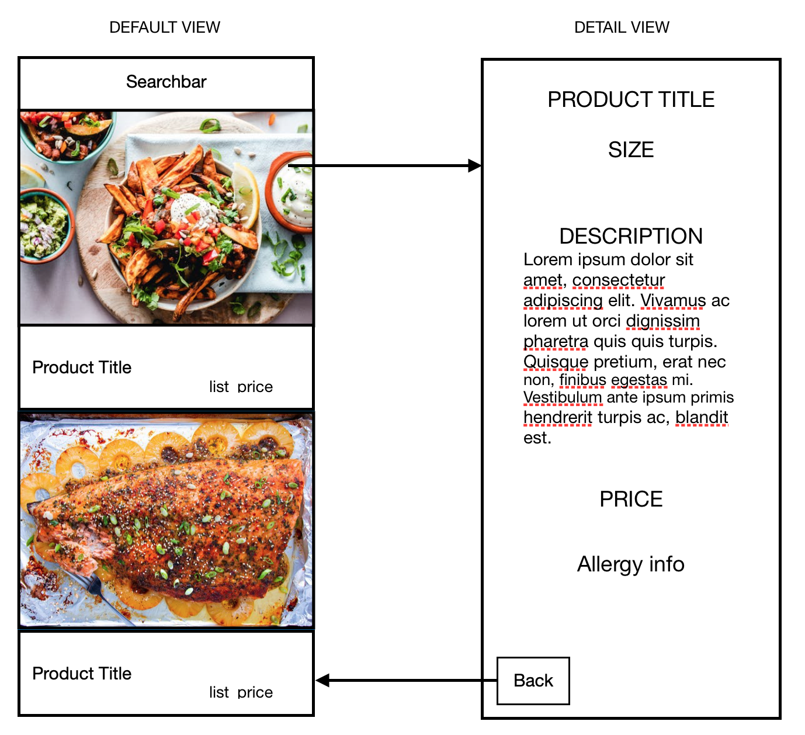

# Gousto Product App
#### Description
An iOS application that pulls product data from the Gousto products API and populates a table, and details view, depending on the search parameters.

---

#### Build and Runtime Requirements
+ Xcode 10.0 or later
+ iOS 8.0 or later
+ OS X v10.10 or later

---
#### Process
 + Create basic app storyboard
 + Create data model for json data
 + Decode Json into readable data and store in a variable
 + Read variable data and transpose in respective labels in table view cells
 + Create search functionality by title name
 + Make sure all UI tests pass

---
#### Original Mockup

#### Final Design

---

#### Reflection

I had a lot of fun with this tech test and, more importantly, learnt a whole lot about iOS development.

I am happy with the UX and overall how the app turned out but I did run into a few issues that I was unable to solve before the due date. For instance, getting the image data from the API proved difficult, I'm not sure if it was due to the fact that the data call returns the images as an object array or that the dictionary title was an integer string ("750"). Which meant that I could not access it with the data model I created and the decoder was failing even if they where optional. If I was able to collect the image data, I had planned to use the SDWebImage framework to load and cache the images in the app.

The other issue I ran into was encoding and saving the JSON data to the app to keep the products persistent. I was able to encode the data, but saving it locally proved problematic. I tried a quite a few model variations without any luck.

If I was to start again I would use Alamofire and Swiftyjson to handle the json requests and save the data persistently. I did a attempt to use them near the end of development but decided against it due to lack of time.
