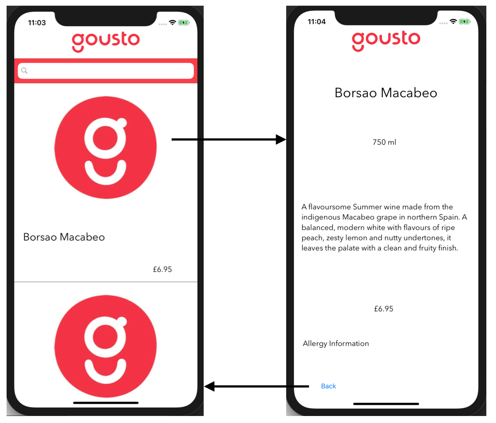

# Gousto Product App
#### Description
An iOS application that pulls product data from the Gousto products API and populates a table, and details view, depending on the search parameters.

---

#### Build and Runtime Requirements
+ Xcode 10.0 or later
+ iOS 8.0 or later
+ OS X v10.10 or later

---
#### Process
 + Create basic app storyboard
 + Create data model for json data
 + Decode Json into readable data and store in a variable
 + Read variable data and transpose in respective labels in table view cells
 + Create search functionality by title name
 + Make sure all UI tests pass

---
#### Original Mockup

#### Final Design

